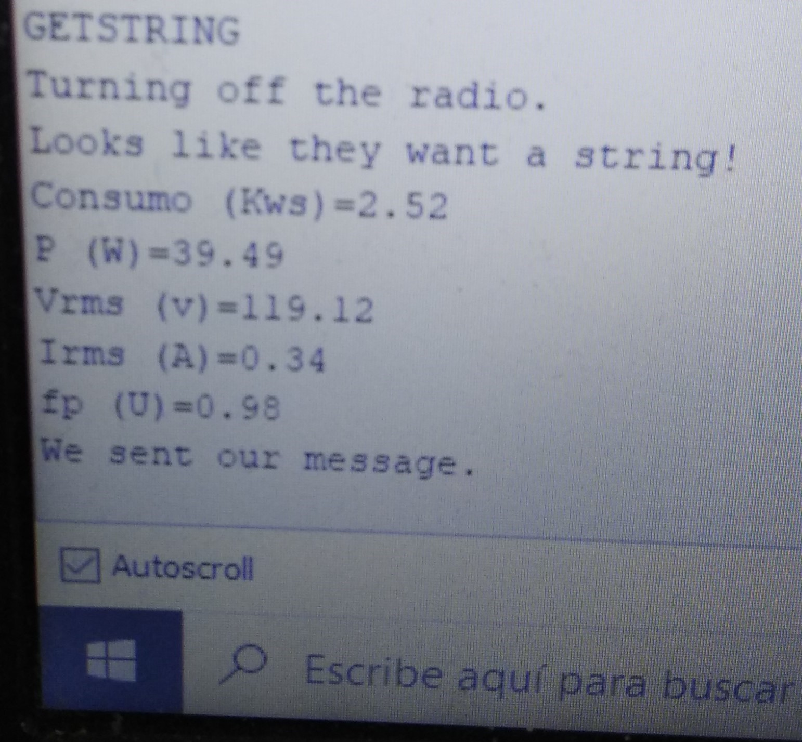

# Arduino Projects
<!-- markdownlint-disable MD033 -->
<!-- markdownlint-disable MD047 -->
## 1. SPWM

This code in the dca folder generates a SPWM with Arduino. The following figure shows the scheme was done.

  

And the other figures show the generated signals.

  

## 2. Position PID control at Stepper Motor

This code in the stepperPIDcontrol folder has position control with a PID. The sensor that measures the position is a potenciometer and the output signals is by using the ULN2003 driver.

## 3. XBEE send a DATA

This code in the xbee_sendData sends a string DATA with Zigbee protocol.

## 4. XBEE PID position control

This code in the xbeePIDServo360control folder has a position controller for a continuous servo. The feedback sensor is a rotative encoder, the senpoint is sending by a computer with ZigBee Protocol and the arduino send to computer the encoder position data. The figure shows the prototype.

  

## 5. Treadmill Prototype

In the folder you can see two fields, the arduino code and the Proteus field for the simulation. In this project is used:
 -Arduino MEGA 2560
 -LCD 16X2
 -DS1307
 -DC Motor
 -Optical Encoder
This Treadmill Prototype has a different tranining modes, before it starts the user enters his weights and calculates the calories of him. The arduino EPROM saves a history of data and the DS1307 manages time for up to a week. The followinf figure shows some functions.

  

## 6. Energy calculation and send it by NRF24L01

With an Arduino, voltage and current sensors the code calculates the energy and sends that data with NRF24L01.
This code receives a message of RPI and sends the energy. The RPI code is in the following link:

<https://github.com/Juanesb230/RaspberryProjects/tree/master/NRF24L01communication>

The next figure shows the energy sent with NRF24L01.

  

## 7. Contact with me

Linkedin: <www.linkedin.com/in/juan-balseca-pinto-9117b397>